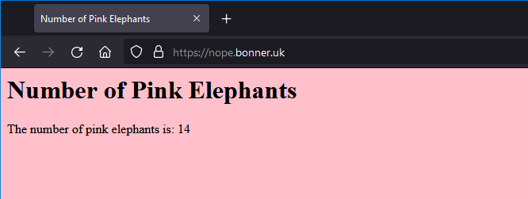
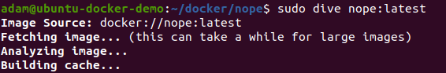
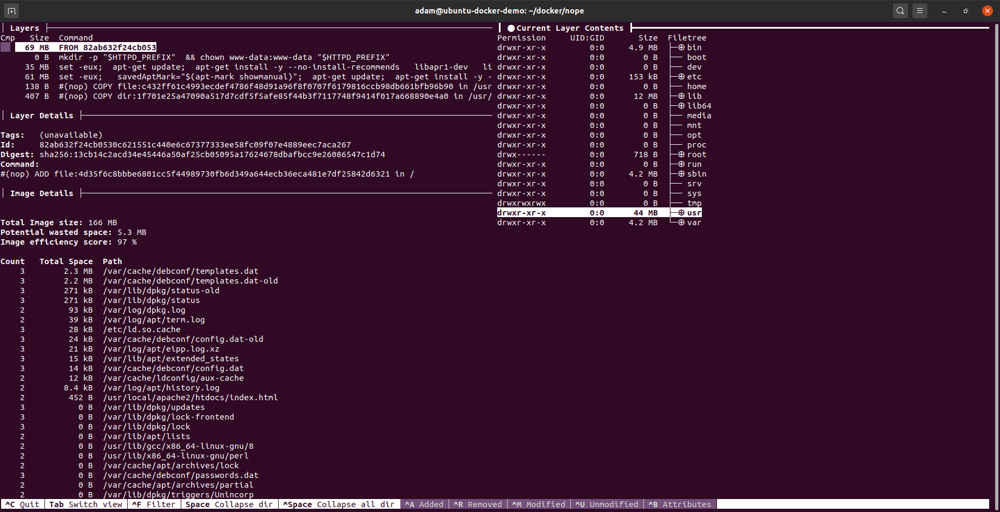
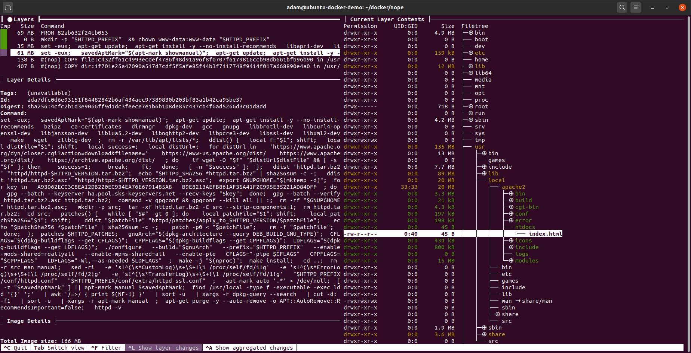
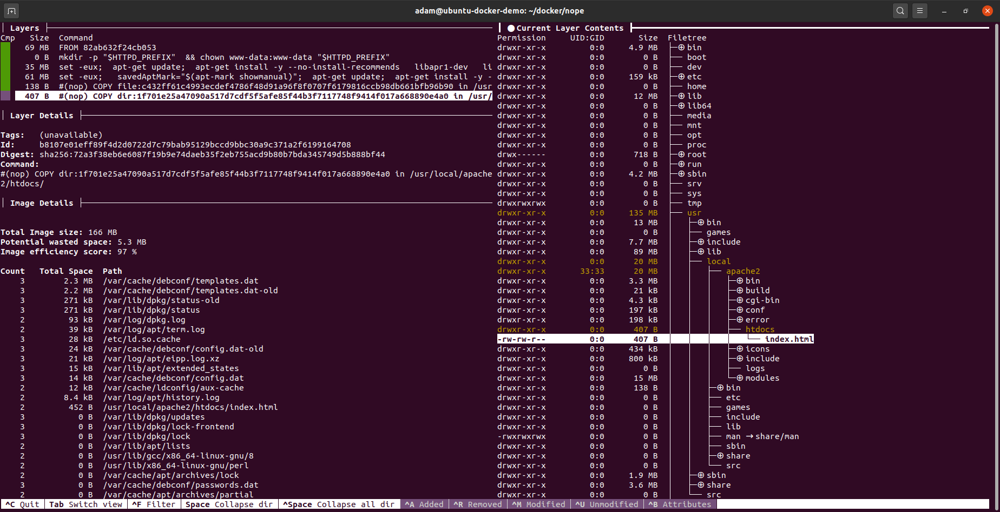

# NOPE / "Number of Pink Elephants"
_Demonstrating Docker, Dive and httpd_

- [Introduction](#introduction)
- [Docker](#docker)
	- [Build](#build)
	- [Run](#run)
	- [Stop](#stop)
- [Docker Hub](#docker-hub)
- [Dive](#dive)
	- [Unpacking the Docker Image with ```Dive```](#unpacking-the-docker-image-with-dive)
- [Future Ideas](#future-ideas)
- [Contributing to this Project](#contributing-to-this-project)
- [Security Policy for this Project](#security-policy-for-this-project)

---
## Introduction
"Number of Pink Elephants"/"NOPE" is a small example Dockerfile project designed to teach (and serve as my own reference for) building, running and hosting Dockerfile images on Github and Docker Hub. Leveraging the publically-maintained httpd image and inserting some .html code, this project documents the process here while being publically available for others to utilise and/or fork.

The website is served via plain-http on port 80 (unlike the image below, this may need mapping). Refreshing the page will give a new random value between 1 and 100.



---
## Docker
### Build
```bash
# optional - clone this repository
git clone git@github.com:adambonneruk/nope.git

# navigate to the project folder and build the Dockerfile
cd nope
docker build -t nope .
```

### Run
```bash
# prune old images/containers/storage if required
docker system prune

# launch the docker image in the bg, allowing you to continue using the shell
docker run -dit --name nope -p 8080:80 nope:latest

# see running docker containers
docker ps
```

### Stop
```bash
docker stop nope
```

---
## Docker Hub

Docker Hub Project URL: https://hub.docker.com/repository/docker/adambonneruk/nope

```bash
# build the image
docker build -t adambonneruk/nope .

# run the image
docker run -p 8080:80 adambonneruk/nope:latest

# push image to docker hub
docker push adambonneruk/nope:latest
```

---
## Dive
### Unpacking the Docker Image with [```Dive```](https://github.com/wagoodman/dive)
using the Dive tool, we can unpack the container image:

```bash
# first install dive
wget https://github.com/wagoodman/dive/releases/download/v0.9.2/dive_0.9.2_linux_amd64.deb
sudo apt install ./dive_0.9.2_linux_amd64.deb

# explore the docker image
sudo dive nope:latest
```
Executing the ```dive``` command:



At the first layer we can see a minimal linux distribution standard filesystem:



At this level we can see apache is being installed to the filesystem:



At the lowest level, we can see my index.html is copied onto the image:



---
## Future Ideas
- Using PHP instead to load local/internal container IP address

---
## Contributing to this Project
This project welcomes contributions of all types. We ask that before you start work on a feature that you would like to contribute, please read the [Contributor's Guide](.github/CONTRIBUTING.md).

---
## Security Policy for this Project
This project seeks to build secure, versatile and robust portable software. If you find an issue, please report it following the [Security Policy](.github/SECURITY.md)