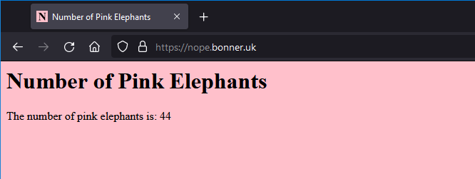

# "Number of Pink Elephants": Apache using Docker
"Number of Pink Elephants"/"NOPE" is a small example Dockerfile project designed to teach (and serve as my own reference for) building, running and hosting Dockerfile images on Github and Docker Hub). Leveraging the publically-maintained httpd image and inserting some .html code, this project documents the process here while being publically available for others to utilise and/or fork.

> The "NOPE" container image/dockerfile project is available on my [Docker Hub](https://hub.docker.com/repository/docker/adambonneruk/nope).

The website is served via plain-http on port 8080 (image below). Refreshing the page will give a new random value between 1 and 100.



## Usage

### Build
```bash
# optional - clone this repository
git clone git@github.com:adambonneruk/nope.git
# navigate to the project folder and build the Dockerfile
cd nope
docker build -t nope .
```

### Run
```bash
# prune old images/containers/storage if required
docker system prune
# launch the docker image in the bg, allowing you to continue using the shell
docker run -dit --name nope -p 8080:80 nope:latest
# see running docker containers
docker ps
```

### Stop
```bash
docker stop nope
```

### [Docker Hub](https://hub.docker.com/repository/docker/adambonneruk/nope) _[in progress]_
```bash
# build the image
docker build -t adambonneruk/nope .
# run the image
docker run -p 8080:80 adambonneruk/nope:latest
# push image to docker hub
docker push adambonneruk/nope:latest
```

## Future Ideas
- Using PHP instead to load local/internal container IP address